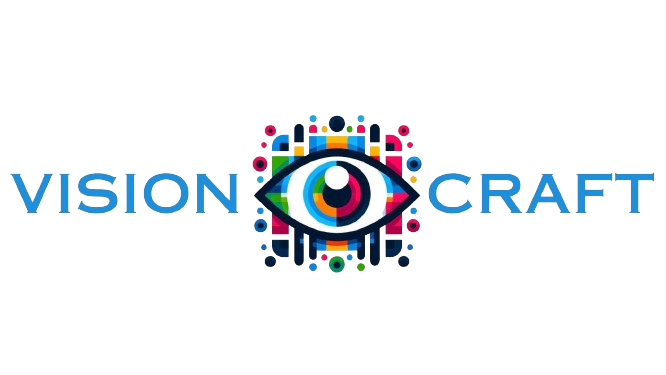

<p align="center">
  
</p>


# VisionCraft

VisionCraft is a simple computer vision utility class using OpenCV, Matplotlib, and NumPy. It provides a set of methods for common computer vision tasks such as image visualization, transformation, and analysis.

## Installation

Ensure you have the required dependencies installed:

```bash
pip install opencv-python matplotlib numpy pandas
```
Install the file to use the class

```bash
wget https://raw.githubusercontent.com/Prem07a/VisionCraft/main/VisionCraft.py
```

Above command fetches the file directly from the GitHub repository and saves it in your current working directory. After downloading the file, you can import the Vision class in your Python script or Jupyter notebook for further use.

Clone the repository:

```bash
git clone https://github.com/your_username/VisionCraft.git
```


## Usage

1. **Importing the `Vision` class:**

   ```python
   from VisionCraft import Vision
   ```

2. **Instantiating the Vision class with an optional image path:**

   ```python
   # Provide the path to your image file
   vi = Vision(path="path/to/your/image.jpg")
   ```

3. **Display the original and negative image:**

   ```python
   vi.imgNegative()
   ```

   This method displays the original image alongside its negative counterpart.

4. **Display the original and logarithmically transformed image:**

   ```python
   vi.imgLog()
   ```

   This method displays the original image alongside its logarithmically transformed version.

5. **Plot the logarithmic transformation and its inverse:**

   ```python
   vi.plotLogTransform()
   ```

   This method plots the logarithmic transformation and its inverse.

6. **Display the original image and its power-law transformations:**

   ```python
   vi.powerLaw()
   ```

   This method displays the original image alongside different power-law transformations.

7. **Plot power-law transformations with different gamma values:**

   ```python
   vi.plotPowerLaw()
   ```

   This method plots power-law transformations with different gamma values.

8. **Display the original image, vertical flip, and horizontal flip:**

   ```python
   vi.flipImg()
   ```

   This method displays the original image, its vertical flip, and horizontal flip.

9. **Display the original image and grayscale level slicing:**

   ```python
   vi.grayLevelSlicing(lower=100, upper=200, bg=False)
   ```

   This method displays the original image alongside grayscale level slicing results.

10. **Display bit-plane sliced images:**

    ```python
    vi.bitPlaneSlicing()
    ```

    This method displays bit-plane sliced images from the original image.

11. **Display the original image and its contrast-stretched version:**

    ```python
    vi.contrastStretching(s1=30, s2=150, r1=80, r2=150, L=255)
    ```

    This method displays the original image alongside its contrast-stretched version.

12. **Display the original image, its histogram, and the equalized histogram:**

    ```python
    vi.histogramEquilization()
    ```

    This method displays the original image, its histogram, and the equalized histogram.

## Documentation

For detailed documentation of each method and its parameters, refer to the docstrings in the `Vision` class.

```python
help(Vision)
```

## License

This project is licensed under the MIT License - see the [LICENSE](LICENSE) file for details.
